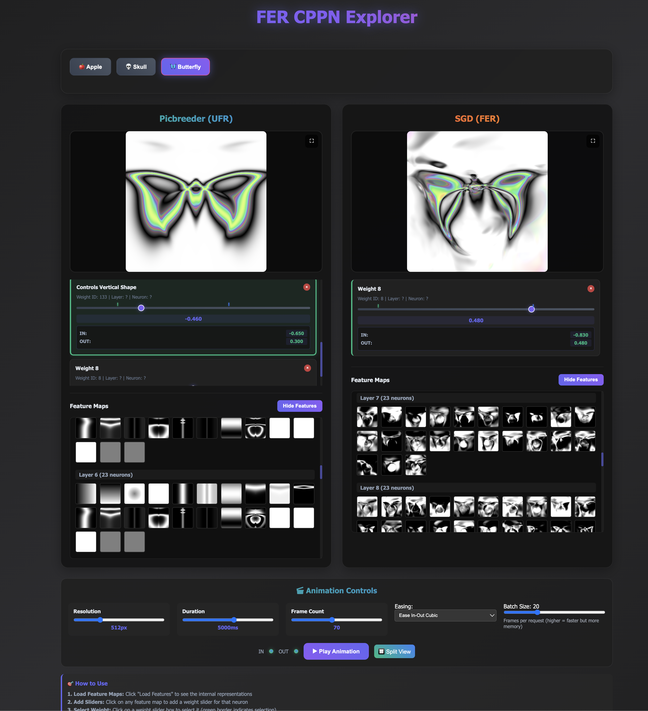

# FER CPPN Explorer: Interactive Visualization of Fractured vs Unified Neural Representations

**Date:** May 30th, 2025  
**Developed by:** Dr. Tim Scarfe, Machine Learning Street Talk (MLST)  
**Original Research:** "Questioning Representational Optimism in Deep Learning: The Fractured Entangled Representation Hypothesis" by Kumar et al. (2025)

## 🎯 Overview

This interactive web application allows researchers and enthusiasts to explore a fundamental question in deep learning: **Do neural networks trained with SGD develop good internal representations, or do they just memorize solutions through fractured, entangled pathways?**

The **Fractured Entangled Representation (FER) Hypothesis** suggests that conventional SGD training often produces networks that achieve perfect performance while harboring deeply flawed internal representations. In contrast, **Unified Factored Representations (UFR)** demonstrate clean, modular, and reusable internal structures.

## 🎬 Interactive Demo



**🎥 [Watch Demo Video](https://f.io/Fto-Gtt5)** - See the interactive visualization in action!

## 🧠 The Core Hypothesis

### Fractured Entangled Representation (FER)
- **Fractured**: Information for the same concept is split into disconnected pieces
- **Entangled**: Behaviors that should be independent inappropriately influence each other
- **Result**: Networks that work but can't generalize, create, or learn efficiently

### Unified Factored Representation (UFR)  
- **Unified**: Single, coherent representation for each concept
- **Factored**: Independent capabilities remain separated and modular
- **Result**: Networks that understand underlying regularities and can build upon them

## 🔬 Research Context

The original paper compares:
- **Picbreeder Networks**: Evolved through open-ended human-guided search, exhibiting UFR
- **SGD Networks**: Trained via conventional gradient descent to match Picbreeder outputs, exhibiting FER

Both networks produce **identical output behavior** but have **radically different internal representations**. This challenges the assumption that good performance implies good representation—what the authors call "representational optimism."

## 🚀 Interactive Features

### Real-Time Visualization
- **Side-by-side comparison** of Picbreeder (UFR) vs SGD (FER) networks
- **Feature map exploration** showing internal representations layer by layer
- **Dynamic weight manipulation** with immediate visual feedback

### Animation System
- **Keyframe-based animation** to visualize weight sweeps and representation changes
- **Per-weight keyframes**: Set individual IN/OUT points for different network weights
- **Smooth interpolation** with multiple easing functions
- **Batch processing**: Efficient generation of 60+ frame animations

### Advanced Interaction Modes
- **Fullscreen visualization** for detailed inspection
- **Split-screen fullscreen** for direct UFR vs FER comparison
- **Bounce loop animations** for continuous exploration
- **Progress tracking** with real-time generation status

### Visual Indicators
- **Keyframe markers** showing IN/OUT points on sliders
- **Color-coded borders** indicating keyframe status
- **Weight value displays** with precise numerical feedback

## 🛠 Technical Implementation

### Backend (Python/FastAPI)
```python
# Core Technologies
- FastAPI: RESTful API server
- PyTorch: Neural network inference
- Pillow: Image processing and generation
- NumPy: Numerical computations
```

**Key Endpoints:**
- `/api/models` - Model metadata and weight suggestions
- `/api/generate_comparison/{model}` - Single frame generation
- `/api/generate_batch/{model}` - Batch frame generation for animations
- `/api/feature_maps/{model}` - Internal representation visualization

**Architecture:**
- **ParameterReshaper**: Manages weight manipulation and optimization
- **Batch Processing**: Handles multiple frame generation efficiently
- **Model Loading**: Supports both Picbreeder and SGD variants

### Frontend (HTML/CSS/JavaScript)
```javascript
// Core Features
- Canvas-based rendering for real-time image updates
- Dynamic slider generation for weight manipulation
- Keyframe animation system with easing functions
- Fullscreen modes with animation support
- Progress bars with batch generation feedback
```

**Key Components:**
- **Animation Engine**: Frame interpolation and playback control
- **Keyframe System**: Per-weight animation with visual feedback
- **Canvas Management**: Dual rendering for UFR/FER comparison
- **Feature Map Viewer**: Interactive exploration of internal representations

### Performance Optimizations
- **Batched API Calls**: Generate multiple frames per request (default: 20 frames/batch)
- **Efficient Rendering**: Canvas-based updates with minimal redraws
- **Smooth Animations**: 60fps playback with configurable duration
- **Memory Management**: Proper cleanup of animation frames and resources

## 📊 Models Included

### Apple Model (46,474 parameters)
- Complex organic shape with stem and background
- Demonstrates color, form, and structure representation
- Clear difference between UFR factorization vs FER entanglement

### Skull Model (5,478 parameters)  
- Symmetric structure ideal for testing regularity representation
- UFR preserves bilateral symmetry, FER treats sides independently
- Showcases anatomical feature decomposition

### Butterfly Model (8,096 parameters)
- Intricate symmetric patterns with natural regularities
- Highlights difference in wing pattern representation
- Demonstrates UFR's superior handling of biological symmetries

## 🎮 Usage Instructions

### Getting Started
1. **Install Dependencies**: `pip install -r requirements.txt`
2. **Launch Server**: `python app.py`
3. **Open Browser**: Navigate to `http://localhost:8000`

### Basic Exploration
1. **Select Model**: Choose Apple, Skull, or Butterfly
2. **Load Feature Maps**: Click "Load Features" to see internal representations
3. **Add Sliders**: Click feature maps to add weight manipulation controls
4. **Explore Differences**: Compare how UFR vs FER represents the same concepts

### Animation Workflow
1. **Select Weight**: Click on a slider to select it (green border)
2. **Set Keyframes**: Press `I` for IN point, `O` for OUT point
3. **Animate**: Press `Space` for normal animation, `R` for bounce loop
4. **Fullscreen**: Click `⛶` for single view or `🔲` for split comparison

### Advanced Features
- **Multiple Weights**: Set keyframes on multiple weights simultaneously
- **Custom Easing**: Choose from linear, cubic, quadratic interpolation
- **Batch Size**: Adjust frames per request (1-60) for performance tuning
- **Export**: Screenshots available in fullscreen mode

## 🔍 Key Insights Revealed

### Weight Sweep Behavior
- **UFR (Picbreeder)**: Smooth, meaningful changes preserving regularities
- **FER (SGD)**: Chaotic distortions breaking fundamental patterns

### Symmetry Representation
- **UFR**: Bilateral symmetry emerges early and persists
- **FER**: Left/right sides encoded separately, symmetry accidental

### Feature Factorization
- **UFR**: Clean separation of semantic components (stem, body, background)
- **FER**: Entangled representations mixing unrelated features

## 📈 Research Implications

This visualization tool demonstrates that:
1. **Performance ≠ Understanding**: Perfect output doesn't guarantee good representation
2. **Training Matters**: How you learn affects what you learn
3. **Representation Quality**: UFR enables better generalization, creativity, and learning
4. **Open-Ended Search**: Alternative to SGD may produce superior representations

## 🤝 Contributing

This fork extends the original research with interactive visualization capabilities. Contributions welcome for:
- Additional model architectures
- New visualization techniques  
- Performance optimizations
- Educational features

## 📜 Citation

```bibtex
@article{kumar2025fractured,
  title={Questioning Representational Optimism in Deep Learning: The Fractured Entangled Representation Hypothesis},
  author={Kumar, Akarsh and Clune, Jeff and Lehman, Joel and Stanley, Kenneth O.},
  journal={arXiv preprint arXiv:2505.11581},
  year={2025}
}
```

## 🔗 Links

- **Original Paper**: [arXiv:2505.11581](https://arxiv.org/abs/2505.11581)
- **Machine Learning Street Talk**: [YouTube Channel](https://www.youtube.com/@MachineLearningStreetTalk)
- **Interactive Demo**: [Live Application](http://localhost:8000)

---

**Built with ❤️ for the ML research community to explore the hidden world of neural representations**
